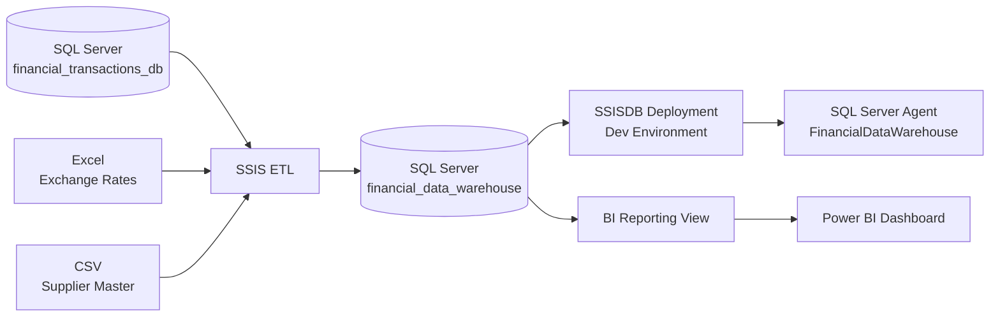

# 🏢 Financial Data Warehouse | SQL Server + SSIS + Power BI

An end-to-end Microsoft data platform portfolio project that integrates **SQL Server, Excel, and CSV data** through **SQL Server Integration Services (SSIS)**, loads an analytical SQL Server warehouse, deploys the package through **SSISDB**, validates execution with **SQL Server Agent**, and exposes a BI-ready reporting layer to **Power BI**.

## 📊 Final Dashboard KPIs

| KPI | Result |
|---|---:|
| **Standardized Transaction Value (USD)** | **$5,611.41M** |
| **Transactions** | **1,000,000** |
| **Customers** | **1,000** |
| **Average Transaction Value** | **$5.61K** |
| **Suppliers** | **3** |

## 🧰 Tech Stack

**SQL Server 2025 · SSMS · SSIS · Visual Studio · SSISDB · SQL Server Agent · Excel · CSV · OLE DB · Power BI · DAX · Power Query**

## 🏗️ Architecture



## 🎯 Business Requirement

The business has financial transaction data recorded in local currencies and needs a single analytical dataset with:

- transaction values standardized to **USD**;
- customer information retained with each transaction;
- supplier contact details enriched from an external source;
- unmatched supplier records captured for data-quality review;
- a repeatable ETL workflow that can be deployed and executed outside Visual Studio;
- a Power BI reporting layer for financial and operational analysis.

## 🔄 SSIS ETL Workflow

### Source Systems

1. **SQL Server** — `financial_transactions_db`
   - 1,000,000 financial transaction records
   - transaction/customer/supplier/date/amount/currency fields

2. **Excel** — exchange-rate reference data
   - source currency
   - target currency
   - exchange rate
   - effective date

3. **CSV** — supplier master
   - supplier ID/name
   - contact name
   - phone

### Transformations

The SSIS package performs the following processing:

- truncates/reloads warehouse staging/reference tables;
- loads exchange-rate data from Excel;
- loads supplier reference data from CSV;
- reads financial transactions from SQL Server;
- performs an **exchange-rate lookup**;
- handles transactions with no matching exchange rate;
- calculates standardized **`amount_USD`**;
- performs a **supplier lookup**;
- separates unmatched/null supplier records for review;
- enriches warehouse transactions with supplier contact information;
- loads the final analytical transaction dataset into the warehouse.

## ⚙️ SSIS Package Components

The main package contains components such as:

- `Source financial_transactions`
- `Lookup exchange_rates`
- `No Exchange Rate`
- `Union All`
- `Create Amount USD`
- `Lookup Suppliers`
- `Split Null Suppliers`
- `Missing Suppliers`
- `Destination datawarehouse financial_transactions`

See [SSIS documentation](./SSIS/README.md) for the deployment and parameter setup.

## 🔧 Parameterization & Environments

The project uses SSIS project parameters rather than hard-coding deployment configuration:

| Project Parameter | Purpose |
|---|---|
| `Financial_transactions_db_ServerName` | Source SQL Server |
| `Financial_data_warehouse_ServerName` | Warehouse SQL Server |
| `CSVSuppliers_ConnectionString` | Supplier CSV path |
| `ExcelExchangeRates_ExcelFilePath` | Exchange-rate Excel path |
| `MissingSupplier_ConnectionString` | Missing-supplier output path |

A **Dev** SSISDB environment maps environment variables to these project parameters.

## 🚀 Deployment

The completed project was:

1. built in Visual Studio with the SSIS Projects extension;
2. deployed to the **SSISDB Integration Services Catalog**;
3. configured using the **Dev** environment;
4. connected to a SQL Server Agent job named **`FinancialDataWarehouse`**;
5. executed successfully through SQL Server Agent.

> A recurring SQL Server Agent schedule and the tutorial's advanced API-call extension were not part of this portfolio version.

## 🗄️ Power BI Reporting Layer

Power BI connects to the warehouse rather than the raw source systems.

A reporting view is provided in:

**[SQL/PowerBI_View.sql](./SQL/PowerBI_View.sql)**

The model contains:

- `FinancialTransactions`
- a dedicated Date table
- a dedicated Key Measures table

### Core DAX Measures

```DAX
Total Transaction Value =
SUM(FinancialTransactions[amount_usd])

Total Transactions =
DISTINCTCOUNT(FinancialTransactions[transaction_id])

Total Customers =
DISTINCTCOUNT(FinancialTransactions[customer_id])

Average Transaction Value =
DIVIDE([Total Transaction Value], [Total Transactions])

Total Suppliers =
DISTINCTCOUNT(FinancialTransactions[supplier_name])
```

## 📈 Dashboard Analysis

The final Power BI report contains:

- **Monthly Transaction Value Trend**
- **Top 5 Customers by Transaction Value**
- **Transaction Value by Supplier**
- **Transaction Value by Source Currency**
- **Transaction Volume by Source Currency**
- slicers for **Date Range, Currency, Supplier, and Customer**

## ✅ Validation

Use [SQL/Validation_Queries.sql](./SQL/Validation_Queries.sql) to validate the warehouse and Power BI KPIs directly against SQL Server.

## 📁 Repository Structure

```text
Financial-Data-Warehouse-SSIS-PowerBI/
├── README.md
├── Data/
│   ├── README.md
│   ├── exchange_rates.csv
│   └── suppliers.csv
├── SQL/
│   ├── PowerBI_View.sql
│   └── Validation_Queries.sql
├── SSIS/
│   ├── README.md
│   └── Parameters.md
├── PowerBI/
│   └── README.md
├── Images/
│   └── README.md
└── SQL_Backups/
    └── README.md
```

## 🧠 Skills Demonstrated

- Multi-source **ETL design**
- SQL Server data warehousing
- SSIS Data Flow and Control Flow
- Lookup, Union All, Derived Column, Conditional Split, and error-handling patterns
- Project parameters and SSISDB environment variables
- SSISDB deployment
- SQL Server Agent execution
- Currency standardization
- Data-quality exception handling
- SQL validation
- Power BI modeling, DAX, KPI design, slicers, and dashboard storytelling

---

This project is designed as a portfolio case study demonstrating the complete path from **source systems → ETL → warehouse → deployment → BI reporting**.
