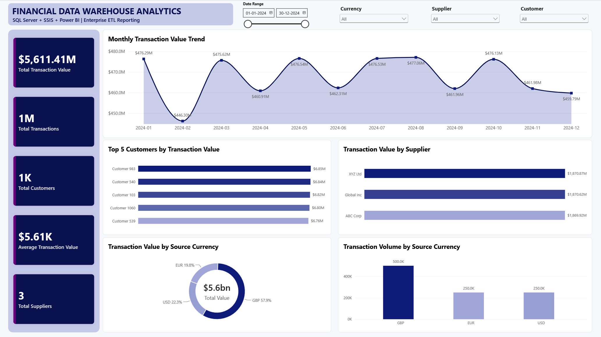
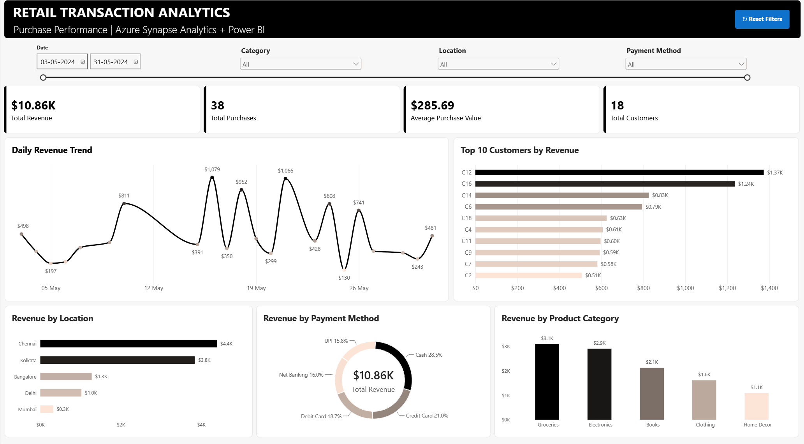
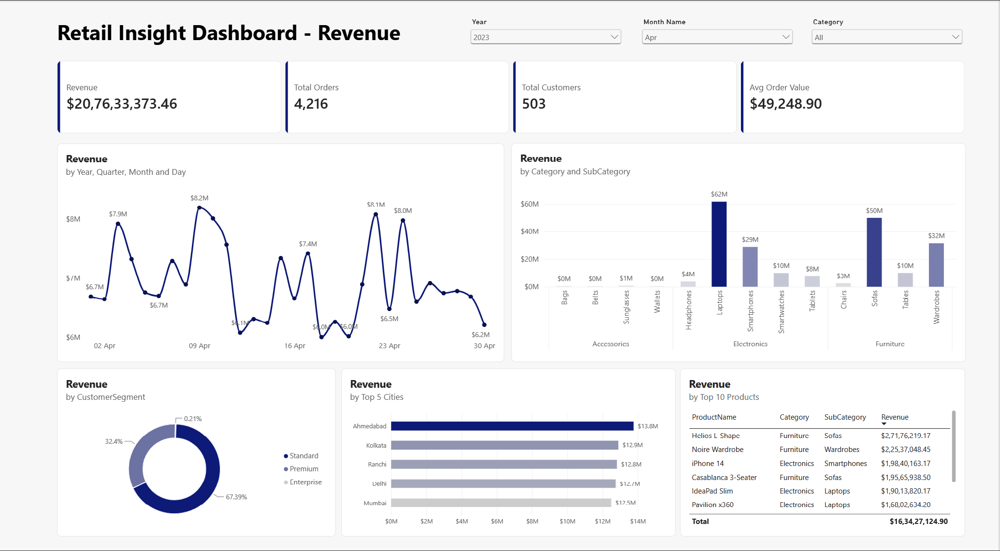
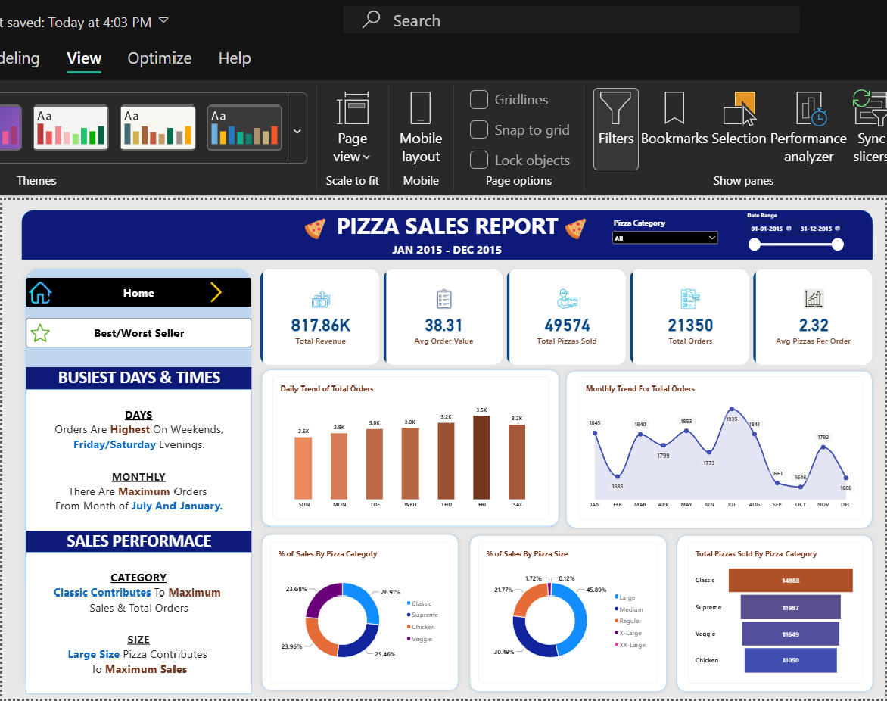

# 📊 Data Analytics & Power BI Portfolio

A portfolio of hands-on **Business Intelligence, Data Analytics, SQL, Cloud, ETL, and Data Warehousing projects** built to demonstrate end-to-end analytical workflows — from source systems and pipelines to modeling, DAX, KPIs, deployment, and interactive dashboards.

**Core Stack:** Power BI · SQL · DAX · Power Query · SQL Server · SSIS · SSISDB · SQL Server Agent · Azure Synapse Analytics · PySpark · Azure Data Factory · ADLS Gen2 · Parquet · Data Modeling

> Projects are listed **newest first**.

---

## 🚀 Featured Projects

### 🏢 [Financial Data Warehouse | SQL Server + SSIS + Power BI](./Financial-Data-Warehouse-SSIS-PowerBI)

**Focus:** Multi-source ETL + SQL Server data warehousing + SSIS deployment + business intelligence  
**Tech:** SQL Server 2025 · SSIS · Visual Studio · SSISDB · SQL Server Agent · Excel · CSV · Power BI · DAX

- Integrated **1,000,000 financial transactions** with external **Excel exchange rates** and **CSV supplier master data** through SSIS.
- Built lookup, currency-standardization, supplier-enrichment, exception-handling, and warehouse-loading logic in SSIS.
- Parameterized the project and deployed it through **SSISDB** using a **Dev environment**, then validated execution through the **FinancialDataWarehouse SQL Server Agent job**.
- Built a Power BI reporting layer with **$5.61B standardized transaction value, 1M transactions, 1K customers, supplier analysis, currency mix, customer rankings, and monthly trends**.

**[View full project →](./Financial-Data-Warehouse-SSIS-PowerBI)**

---

### 🏗️ [Retail Transaction Analytics | Azure Synapse + PySpark + Power BI](./Azure-Synapse-Analytics)

**Focus:** Medallion architecture + PySpark data engineering + business intelligence  
**Tech:** Azure Synapse Analytics · PySpark · ADLS Gen2 · Parquet · Power BI · DAX

- Built an end-to-end **Bronze → Silver → Gold** analytics workflow using Azure Synapse Spark.
- Applied PySpark data-quality rules to filter purchase events, handle null/blank customer IDs, standardize fields, and enforce analytical data types.
- Created a **single BI-ready Gold Parquet table** supporting analysis across date, customer, product, category, location, and payment method.
- Developed an interactive Power BI dashboard with **revenue, purchases, average purchase value, customers, trends, rankings, and filter/reset interactions**.

**[View full project →](./Azure-Synapse-Analytics)**

---

### ☁️ [Retail Insights | Azure Data Factory + ADLS Gen2 + Power BI](./Retail-Insights-Azure-ADF)

**Focus:** Cloud data pipeline + retail business intelligence  
**Tech:** Azure Data Factory · ADLS Gen2 · Azure Storage · Power BI · Power Query · DAX · Data Modeling · ETL

- Built a cloud-based workflow moving **customer, product, and 97,500 sales records** through an Azure Data Factory pipeline.
- Used **ADLS Gen2 input/output layers** to separate source ingestion from the reporting layer.
- Built an interactive Power BI dashboard covering **revenue, orders, customers, category/subcategory performance, customer segments, cities, products, and trends**.
- Demonstrates an end-to-end path from **cloud ingestion → pipeline orchestration → BI modeling → dashboard reporting**.

**[View full project →](./Retail-Insights-Azure-ADF)**

---

### 🍕 [Pizza Sales Analysis | SQL Server + Power BI](./Pizza-Sales-Analysis)

**Focus:** SQL analysis + KPI validation + Power BI reporting  
**Tech:** SQL Server · SSMS · SQL · Power BI · DAX · Data Modeling

- Analyzed transactional pizza sales using SQL before building the dashboard in Power BI.
- Developed and validated KPIs including **revenue, average order value, orders, pizzas sold, and average pizzas per order**.
- Analyzed **daily/monthly trends, category and size contribution, and Top/Bottom 5 product performance**.
- Demonstrates SQL-based business analysis and validation of Power BI results against source-level calculations.

**[View full project →](./Pizza-Sales-Analysis)**

---

### 📈 [Sales Insights Dashboard](./Sales-Insight-Dashboard)

**Focus:** Sales performance analysis and executive reporting  
**Tech:** Power BI · SQL · Data Modeling · Data Visualization

- Analyzes **revenue and sales quantity across regions, customers, and products**.
- Highlights **Top 5 customers, Top 5 products, regional performance, and sales trends over time**.
- Uses interactive filtering and drill-down analysis to support business performance monitoring.

**[View full project →](./Sales-Insight-Dashboard)**

---

### 💰 [Finance Dashboard](./Finance-Dashboard)

**Focus:** Personal finance KPI tracking and cash-flow analysis  
**Tech:** Power BI · DAX · Google Sheets · Data Visualization

- Tracks **income, expenses, savings, EMI payments, and net cash flow**.
- Includes **All-Time vs Last-Month KPIs** and detailed expense breakdowns.
- Uses Google Sheets as the source and Power BI for modeling, calculations, and reporting.

**[View full project →](./Finance-Dashboard)**

---

## 🛠️ Skills & Technologies

| Area | Tools & Skills |
|---|---|
| **Business Intelligence** | Power BI Desktop, Dashboard Development, KPI Reporting, Data Storytelling |
| **Analytics & Modeling** | DAX, Power Query, Data Modeling, Relationships, Trend Analysis, Segmentation |
| **SQL & Databases** | SQL, Microsoft SQL Server, SSMS, Data Warehousing, Aggregations, Joins, KPI Validation |
| **ETL & Orchestration** | SSIS, SSISDB, SQL Server Agent, Parameters, Environment Configuration, Lookup & Error Handling |
| **Cloud & Data Engineering** | Azure Synapse Analytics, PySpark, Azure Data Factory, ADLS Gen2, Parquet, ETL Pipelines, Medallion Architecture |
| **Data Preparation** | Data Cleaning, Type Conversion, Validation, Transformation, Source-to-report workflows |
| **Business Analysis** | Revenue Analysis, Product Performance, Customer Analysis, Operational & Financial KPIs |

---

## 📌 Portfolio Highlights

Across these projects, I have practiced how to:

- Translate business questions into measurable **KPIs and analytical requirements**.
- Build **SQL queries and warehouse reporting layers** for aggregation, trend analysis, ranking, and source validation.
- Design interactive **Power BI dashboards** with DAX measures, slicers, relationships, and data models.
- Build and deploy **SSIS ETL workflows** using multi-source integration, parameters, SSISDB environments, and SQL Server Agent execution.
- Build **Azure data pipelines and medallion workflows** using Synapse, PySpark, ADF, ADLS Gen2, and Parquet.
- Prepare and transform data using **Power Query**.
- Validate dashboard outputs against underlying data and communicate insights clearly.

---

## ▶️ Using the Projects

Each project folder contains its own documentation and available supporting assets such as:

- Power BI report files where available
- Source/sample datasets
- SQL scripts
- ETL/data-engineering documentation
- Dashboard and pipeline screenshots where available
- Project-specific README documentation

Open any project above to see its architecture, business questions, workflow, and implementation details.
